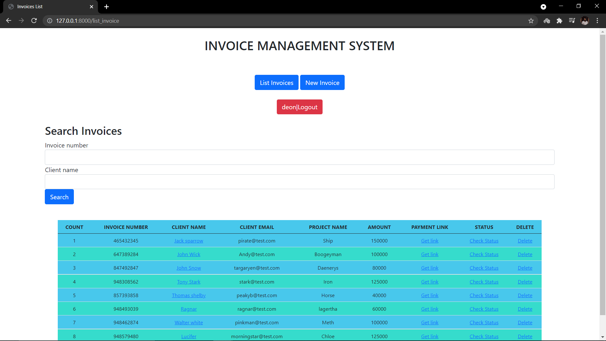
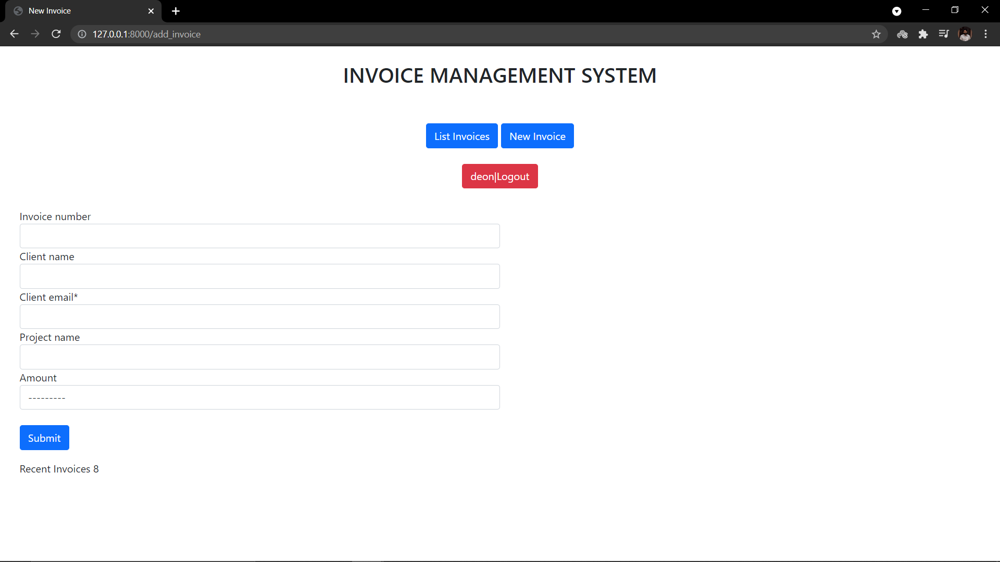
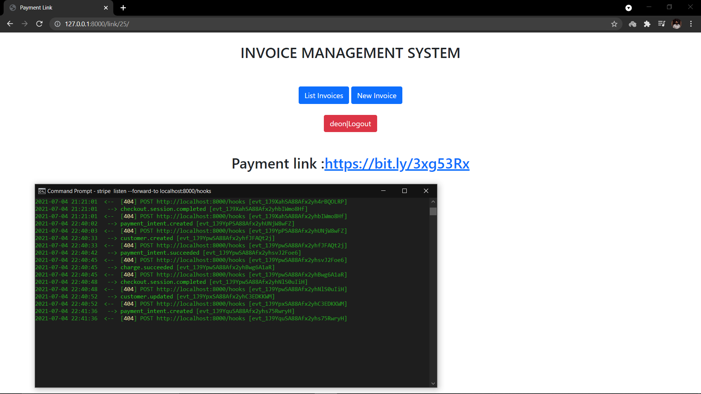

# INVOICE_MANAGEMENT_SYSTEM
***
## Python (Django) invoice_management_system
### This is an Invoice_Management_System that is made using Django.
### In this application, you can Create, edit and Get unique payment URL for Invoices. 
### Stripe is used for payment links and bitly is used to Shorten the urls. 
### Stripe Webhooks are Used to get the Status of the Payment. This application is still under development.
***
# Requirements
***
To work this application first you need to create a virtual environment.You can use pip instaler to install the reequired packages.
```
$ django
$ djangorestframework
$ bitly_api
$ stripe
```
Note: You can use any tool such as Pycharm, Visual Studio code, etc...
***
# Screenshots



